= NGINX : TP CLASSE
:title-page:
:sectnums: |,all|
:toclevels: 4
:icons: font
:source-highlighter: highlight.js
:experimental:

== Création d'une instance

 

[source, terminal]

Commande : Multipass launch -n Srv-Sio

Mantenant que notre instance est créée il faut installer Nginx 

[source , terminal]

Commande : sudo apt update 
           sudo apt install nginx 

[WARNING]
-y pour éviter l'interactivité (Yes or Not)

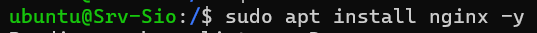 

== Configuration du Nginx 

On va se rendre dans sites-availables

[source, terminal]

/etc/nginx/sites-availables
sudo cp default slam 
sudo cp default sisr 

Voilà le résultat attendu : 

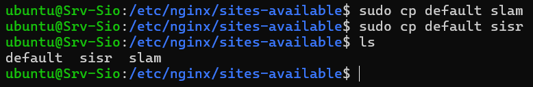 

On va copier/coller default dans slam et sisr puis modifier la partie "Virtual Host" 

Pour modifier facilement se mettre en root 

[source, terminal]

sudo su root

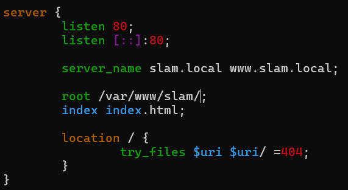

* on va avoir le nom du site web "nom de domaine" représenté par serveur_name 

* le chemin ou le site se trouve représenté par root 

* le fichier pointer et représenté par index   

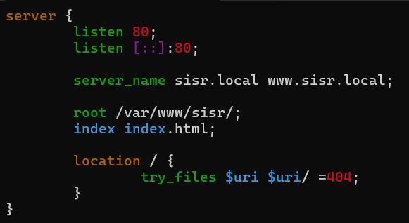 

* Meme chose pour sisr

== Création du lien symbolique   

* Pour que nos serveurs créer en amont soit fonctionnel, il faut créer le lien symbolique de nos fichiers de configuration et les stocker dans le répertoire /etc/nginx/sites-enabled/

[source, terminal]

cd /etc/nginx/sites-enabled 
sudo ln -s /etc/nginx/sites-avaible/slam /etc/nginx/sites-enabled/
sudo ln -s /etc/nginx/sites-avaible/sisr /etc/nginx/sites-enabled/

* Voila le résultat attendu 

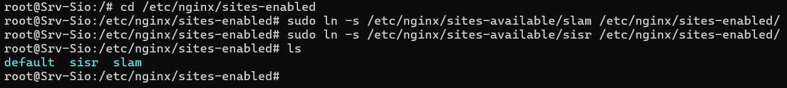 

== Création des chemins du "root" des fichiers de configuration :

[source, terminal]
sudo mkdir /var/www/slam
sudo mkdir /var/www/sisr

* On va copier le fichier index.html du répertoire html

[source, terminal]

chemin : /var/www/html/index.html

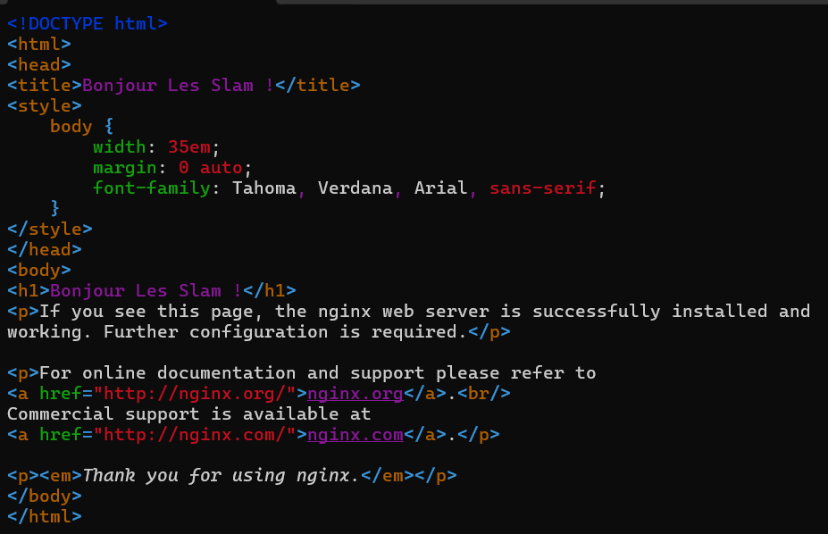 

== Redemarrage de nginix 

[source, terminal]
commande : sudo systemctl restart nginx ( ou sudo nginx -s reload)
           sudo systemctl restart nginx

* Résultat attendu 

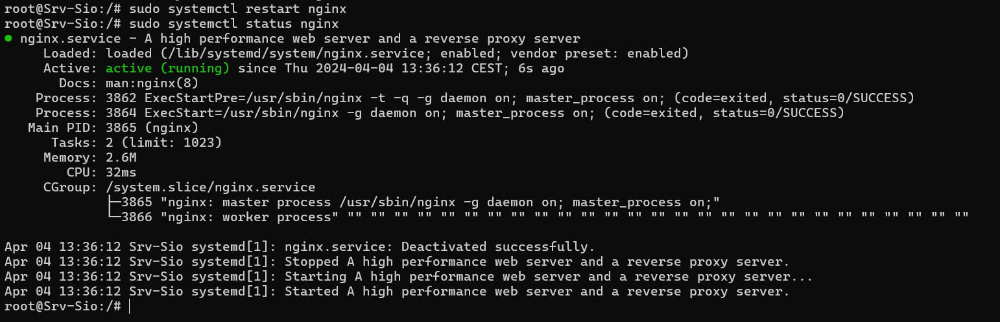 

== Ajout des noms de domaines et des adresses ip dans le fichier host de la machine physique 

* Sur la machine hote ouvrir un bloc note (en administrateur) et chercher le fichier hosts 
[source, terminal ]
chemin : C:\Windows\System32\drivers\etc\hosts

Cela et nécessaire car nos machines ne foctionne pas avec les noms de dommaine mais avec les adresse IP en faisant cela on va afecter chaque non de domaine à une adresse IP, pour que notre service DNS puisse le résoudre en IP quand on fera une rechercher par nom de domaine. 

On va maintenant ajouter 4 fois notre adresse IP (du serveur nginx) avec les 4 noms de domaines derière pour chacun d'entre eux 

[WARNING] 
Pour cela il faut déjà connaitre l'adresse IP on va faire ip a et prendre l'adresse en 192.ect...

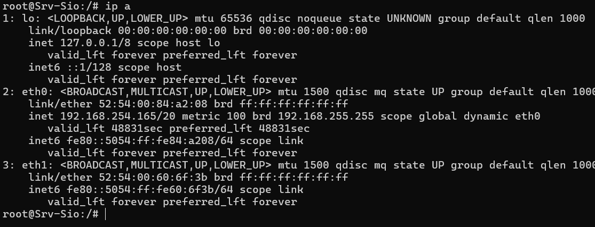 

Et on va maintanant ajouter ça au bloc note 

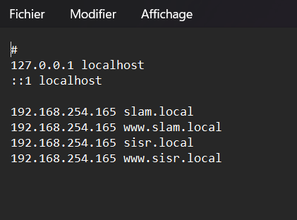 

== Vérification 

On va pour finir aller sur nos pages en mettant les 4 noms de domaines 

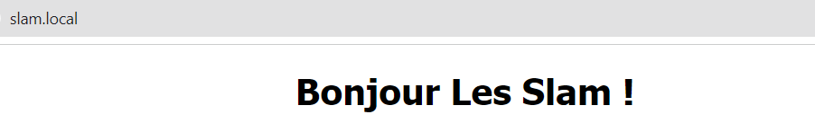 

___

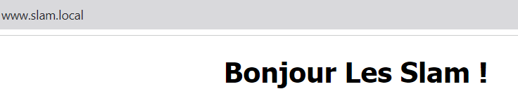 

___

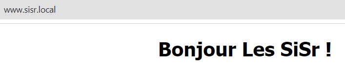 

___

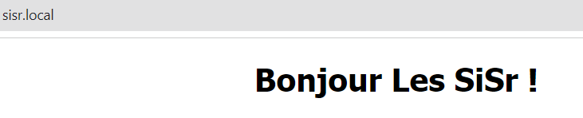 